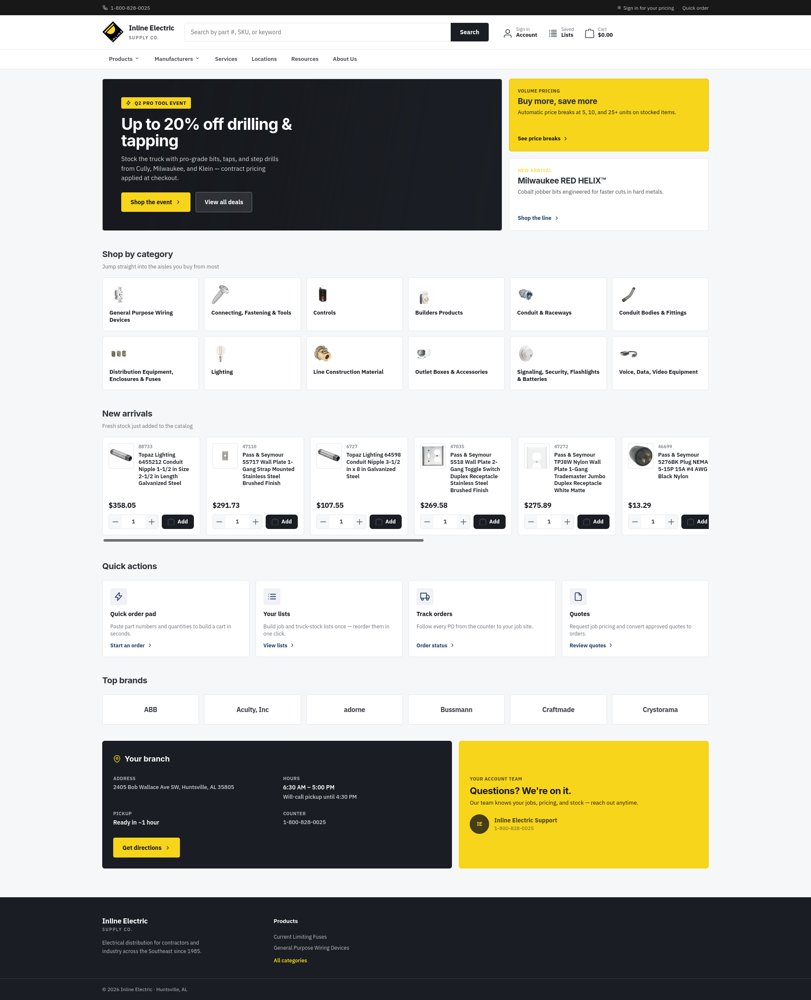

# Basetheme — Shopware 6 Full-Stack Ecommerce Development

*A sanitized project-level case study covering full-stack Shopware 6 storefront, CMS, plugin, data, configuration, and production-support work.*

> Production source code, credentials, private repository information, and
> client-specific configuration are intentionally excluded.

## Project Overview

A Shopware 6 ecommerce implementation covering storefront development, CMS
customization, custom plugins, administration functionality, catalog data,
configuration, deployment, and production support.

## My Role

I worked across the full Shopware application stack, translating design and
business requirements into storefront components, theme behaviour, plugins,
merchant configuration, data workflows, and production-ready deployment.

## Delivery Scope

### Storefront

- Custom Twig templates and storefront overrides
- Responsive components and layout behaviour
- Product and category presentation
- JavaScript and SCSS development

### Theme

- Custom Shopware theme implementation
- Theme configuration exposed through the administration
- Twig inheritance and reusable partials
- Header, navigation, listing, and product-detail customization
- Responsive behaviour across desktop and mobile

### Plugins and Administration

- Custom CMS functionality
- Category and merchandising enhancements
- Administration components and configuration
- Storefront data extensions using Shopware services and events

### CMS and Shopping Experiences

- Shopping Experiences layouts
- Custom CMS blocks and elements
- Merchant-configurable content sections
- Responsive CMS presentation

### Catalog and Data

- Product/category configuration
- Catalog-data work
- Import and migration workflows
- Custom fields and structured configuration where required

### Infrastructure and Support

- Deployment and release support
- Linux, Nginx, and PHP-FPM environment work
- Redis and OpenSearch support
- Production debugging and ongoing maintenance

## Engineering Approach

The implementation used Shopware's supported extension mechanisms and kept
custom storefront behaviour separated into themes, plugins, administration
components, and configuration. The goal was to keep business-specific
functionality maintainable without creating a broad fork of the core
storefront.

## Technologies

`Shopware 6` `PHP` `Symfony` `Twig` `Vue.js`
`DAL` `JavaScript` `SCSS` `MySQL`
`Redis` `OpenSearch` `Nginx` `PHP-FPM`

## Screenshots

### Homepage

The homepage capture demonstrates the reusable storefront foundation, responsive layout, merchandising areas, navigation, and CMS presentation delivered through the Shopware implementation.

  

> Additional category, product-detail, theme-configuration, and CMS screenshots can be added as the public portfolio evolves.

---

[← Back to portfolio overview](../README.md)
