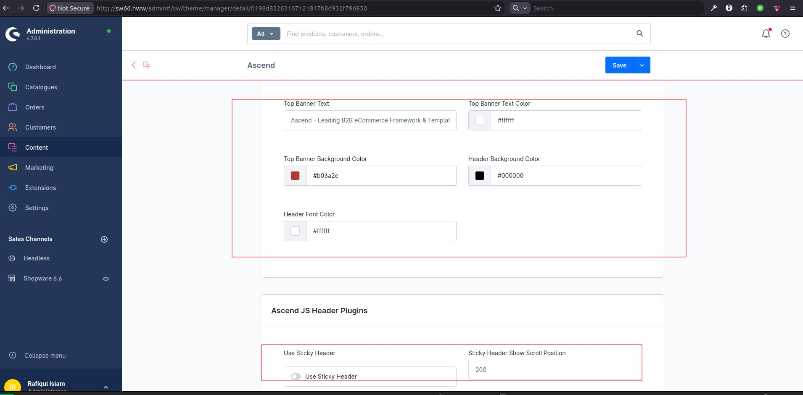
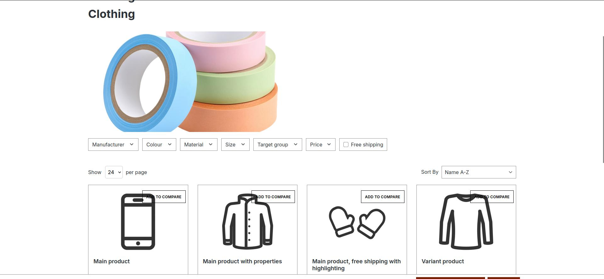
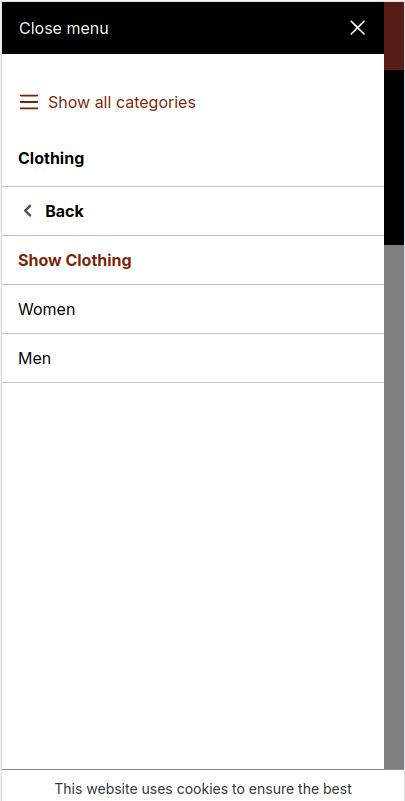
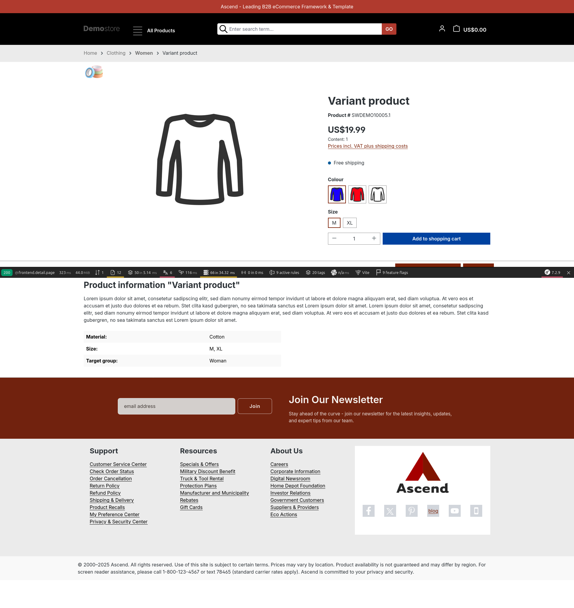

# Custom Storefront Theme

*A B2B-oriented Shopware 6 storefront theme built by extension rather than replacement — configurable in the administration and structured to reduce upgrade maintenance.*

## Business Problem

The default Shopware storefront is a capable, deliberately neutral retail template. For a B2B distributor it is the wrong starting point in several specific ways:

- **Brand identity is generic.** Colours, header treatment, and typography read as a demo store, not as an established supplier.
- **The default header wastes the most valuable space on the page.** B2B buyers navigate by search and by category far more than by browsing merchandising. The default arrangement doesn't reflect that priority.
- **Category browsing on mobile is weak.** Deep, wide catalogs need navigation that is reachable without scrolling past the whole product grid.
- **Listing controls are incomplete for the use case.** Buyers comparing many similar products want to control result density; the default offers sorting but no per-page control.
- **Product detail emphasises the wrong things.** Consumer-oriented tax and pricing presentation and a separated product title don't match how a trade buyer reads a page.

Copying large portions of the storefront and editing them directly can create significant maintenance work. Copied templates stop inheriting upstream changes in the areas they replace, so platform upgrades require those custom copies to be reviewed against changes in the core storefront.

The real requirement was therefore two-sided: a distinctly branded, B2B-appropriate storefront, built so that platform upgrades remain routine.

## Solution

A custom theme that **extends** the storefront rather than replacing it. Every template override inherits from its core counterpart and overrides only the specific blocks that need to change, calling through to the parent for everything else.

The practical consequence is that the theme's custom surface area stays deliberate. Blocks that are not overridden remain inherited from the storefront, while the intentionally changed blocks are the areas that need focused review during upgrades.

On top of that foundation:

- **Merchant-configurable branding** — colours, banner content, and header treatment are theme configuration fields in the administration, not values in a stylesheet. A colour change is a setting, not a deployment.
- **A B2B-appropriate header** — a configurable promotional top banner, a repositioned and visually prominent search, and an optional sticky navigation that follows the user down long listing pages.
- **Mobile-first category navigation** — category navigation moves into an off-canvas panel on small viewports, so a deep catalog stays one tap away.
- **Listing controls suited to trade buying** — a results-per-page control alongside sorting.
- **A restructured product detail page** — product identity moved into the purchasing area and consumer-oriented tax presentation removed.
- **A newsletter capture block** in the footer, submitting asynchronously with inline success and error feedback.

## My Contribution

I designed and built the theme end to end: the theme configuration schema, the full Twig override layer, the SCSS architecture, the custom JavaScript plugins, the CMS element styling and overrides, and the responsive behaviour. I also established the extend-don't-copy convention used throughout the theme to reduce duplicated storefront code and keep upgrade review focused.

## Theme Configuration

Branding and behaviour are exposed as theme configuration fields, grouped into labelled blocks in the administration so related settings appear together rather than as a flat list.

Configurable without touching code:

| Setting | Type | Purpose |
|---|---|---|
| Primary and secondary colour | Colour | Core brand palette |
| Border and background colour | Colour | Surface treatment |
| Top banner text | Text | Promotional or announcement message |
| Top banner text and background colour | Colour | Banner styling |
| Header background and font colour | Colour | Header treatment |
| Sticky header | Switch | Enables the sticky navigation behaviour |
| Sticky header scroll position | Integer | Scroll depth at which the sticky header appears |

Two details matter here more than the field list itself.

**Configuration reaches both layers.** Colour values are consumed as SCSS variables at compile time, while behavioural settings are read in Twig and passed to JavaScript as element options. A single administration setting therefore drives styling, markup, and script behaviour consistently — the sticky header switch doesn't just hide the element, it prevents the plugin being registered at all.

**Labels are translated.** Every field and block label carries translations, so the theme's configuration screen is not an English island inside a localised administration.

## Twig Inheritance

The theme's template layer follows one rule consistently: **extend the core template, override the narrowest possible block, and call the parent**.

Patterns used throughout:

- **Additive overrides.** A block is overridden to insert new markup before or after a call to the parent block — used for the top banner above the header, and the newsletter block above the footer content. Core markup is untouched.
- **Targeted replacement.** Only the specific block whose markup must change is overridden — for example the search column in the header, or the sorting control in the listing.
- **Deliberate suppression.** Where a core section is intentionally removed, its block is overridden empty rather than the surrounding template being copied. This makes the removal explicit, greppable, and trivially reversible — and, importantly, it leaves the block structure intact for anything else extending it.
- **Namespaced includes.** Theme partials are included through the theme's own Twig namespace so references remain explicit across the intended theme inheritance chain.
- **Defensive variable resolution.** Several overrides need a category context that different page types expose differently. Rather than assuming one shape, the templates resolve through a documented fallback chain — the page's own category, then the active navigation, then the product's SEO category, then a breadcrumb lookup by identifier, then the global navigation context. This is what makes shared components such as breadcrumbs and category headings behave correctly on category pages, product pages, search results, and landing pages without a separate template for each.

The `parent()` call keeps overrides narrow. Blocks that are not explicitly changed continue to render the inherited storefront markup, reducing the amount of code that must be manually reconciled during upgrades.

## SCSS

**Structure.** Styles are split into an override entry point, a base stylesheet, and partials by concern — layout, components, and feature-specific files — imported from a single entry rather than registered individually.

**Variable overrides are separated.** Bootstrap and Storefront SCSS variables are declared in a dedicated override file that is compiled before the storefront's own styles, which is required for `!default` variable overrides to take effect at all. Mixing these into the main stylesheet is a common cause of overrides that appear to do nothing.

**Theme configuration flows into SCSS.** Colour and styling settings from the administration are consumed as SCSS variables, so a merchant changing the primary colour recompiles the theme with that value rather than having it hard-coded.

**Design tokens over literals.** Component styles reference the storefront's spacing and colour custom properties where available, with literal fallbacks. Components therefore inherit the platform's spacing rhythm and respond to theme changes instead of drifting from it.

**Scoped selectors.** Component styles are nested under their component's root class, which keeps specificity local and prevents the theme leaking styles into core or plugin markup.

## JavaScript

All custom behaviour is written against **Shopware's storefront plugin system** rather than as standalone scripts — extending the platform's plugin base class and registering through the plugin manager with a CSS selector and default options. This keeps the custom behaviour within Shopware's storefront plugin lifecycle and allows configuration to be passed from Twig through element options.

Three plugins:

**Sticky header.** Clones the navigation, appends it to the document, and reveals it once the user passes a configurable scroll depth. Notable behaviours:

- It **subscribes to the platform's viewport events** and disables itself entirely on small viewports, where a sticky duplicate of the navigation would consume scarce vertical space. On viewport change it re-evaluates and initialises or tears itself down accordingly, rather than only checking on page load.
- It **removes the duplicated element's identifier attribute** when cloning — a small detail that prevents duplicate IDs in the document, which avoids duplicate IDs and the accessibility or selector problems they can create.
- Its scroll threshold comes from theme configuration through element options.

**Category navigation off-canvas.** Reuses the storefront's own off-canvas implementation rather than implementing a panel, so the mobile category panel inherits the platform's focus handling, backdrop, and close behaviour and matches the filter panel shoppers already know.

**Newsletter subscription.** Submits the footer form asynchronously through the storefront's HTTP client service, disables the submit control while in flight to prevent duplicate submissions, and renders success and error feedback inline using translated messages passed from Twig. The form posts to the core newsletter route and works as a normal form submission if JavaScript fails — the plugin enhances it rather than owning it.

## CMS Styling

The theme customises CMS output through the same extend-and-override approach used for page templates:

- **Category navigation element.** Extended to add an active-category heading and a mobile toggle, and restructured so the panel reuses the storefront's filter-panel markup and styling — giving the category navigation the same visual language and interaction model as filtering, which is the pattern shoppers on a listing page are already using.
- **Product heading block.** Extended to suppress the standalone product name element, because the theme relocates product identity into the buy widget on the detail page.
- **Product slider styling.** Component styles that adjust slide sizing per breakpoint for a higher-density slider than the default, and restyle the in-slider purchase control to the theme's palette.

## Header, Footer and Navigation

**Header.**

- A configurable promotional top banner rendered above the header, driven by theme configuration and hidden entirely when no text is set.
- Search repositioned and reordered so it takes visual priority, with responsive column ordering so it stays prominent on mobile.
- Header background and font colours driven by theme configuration.
- Optional sticky navigation, wrapped conditionally on the theme setting — when disabled, the wrapper and its data attributes are not rendered at all, so no plugin is initialised.
- The default navigation block in the base layout is suppressed and rendered through the theme's own arrangement.

**Footer.**

- A newsletter capture block prepended to the footer content, above the parent footer output.
- A custom footer menu.
- A footer legal and accessibility bar, including screen-reader assistance contact information.

**Navigation.** Category navigation is presented as a filter-style panel on desktop and moves into an off-canvas panel on mobile, using the platform's own off-canvas implementation.

## Product Listing

- **Results-per-page control** alongside sorting, submitting as a standard form so it works without JavaScript.
- **Relabelled sorting control** with an explicit visible label rather than a bare select, plus a preserved accessible label.
- **Product card overrides** for layout and badge, image, and pricing presentation, extending core card templates rather than replacing them — including retaining core's video and spatial-media handling, which a copied card template would have quietly lost.
- **Listing wrapper data attributes preserved**, so core's asynchronous pagination and filtering continue to function unchanged.
- **Category title and description** rendered above the listing, resolved through the fallback chain described under Twig Inheritance so it works on category pages, search results, and landing pages alike, and deliberately suppressed on the homepage.

## Product Detail

- **Product name relocated** into the buy widget, adjacent to price and purchasing controls, by rendering the core product-name CMS element with a constructed element configuration — reusing core's element rather than hand-writing a heading, so its markup and styling stay consistent with the rest of the page.
- **Tax presentation removed** from the buy widget, as it did not fit the B2B pricing presentation.
- **Breadcrumb resolution hardened.** Product pages don't always expose a category directly, so the breadcrumb resolves through the product's SEO category, its first assigned category, or a breadcrumb lookup by SEO category identifier. This provides a fallback for product pages reached from contexts where a direct category object is not available.
- **Category context heading** rendered above the product content, using the same resolution chain.
- **CMS breadcrumb block suppressed** to avoid duplicate breadcrumb rendering, since the theme renders breadcrumbs from the base layout.

## Responsive Behaviour

- **Mobile-first category navigation** via the off-canvas panel, so a deep catalog is reachable without scrolling past the product grid.
- **Viewport-aware JavaScript.** The sticky header actively disables itself on extra-small, small, and medium viewports through the platform's viewport detection, and re-evaluates on viewport change. Behaviour is switched off at the plugin level rather than hidden with CSS, so no clone is created and no scroll listener runs on mobile.
- **Responsive column ordering** in the header, so search retains priority when the header stacks.
- **Breakpoint-tuned slider density**, with slide sizing adjusted per breakpoint rather than one setting scaled everywhere.
- **Grid reflow rather than concealment.** Responsive layouts change column counts; content is not hidden at small sizes, so nothing becomes unreachable on mobile.

## Shopware Upgrades and Compatibility

Upgrade maintainability was a design constraint from the outset, not a later concern.

**Extension over duplication.** Every template override extends its core counterpart and overrides named blocks, calling the parent for the remainder. Keeping overrides narrowly scoped allows more upstream storefront behaviour to remain inherited and limits upgrade review to the areas the theme deliberately changes.

**Theme inheritance declared explicitly.** The theme declares the storefront in its view, style, script, and asset inheritance chains, so platform assets and templates resolve ahead of the theme's own additions and the theme layers on top rather than displacing them.

**Reuse of platform implementations.** The off-canvas panel, HTTP client, viewport detection, plugin base class and manager, slider implementation, filter-panel markup, and CMS elements are all consumed from the platform rather than reimplemented. Each reuse is one less thing to re-verify against a new release — and one less place where the theme can drift out of step with core behaviour.

**Deprecation markers respected.** Where core templates carry deprecation notices for blocks scheduled for removal, the overrides target the replacement block rather than the deprecated one, so the theme does not accumulate work that a future major release will break.

**Behaviour driven by configuration, not forks.** Features such as the sticky header are switched by theme configuration rather than by maintaining template variants, so there is a single code path to verify after an upgrade.

**No core modification.** The theme introduces no core patches or monkey-patched JavaScript, and it avoids broad template copies from the platform. This keeps upgrades focused on dependency updates, theme recompilation, and verification of the deliberately overridden areas rather than maintenance of a storefront fork.

## Screenshots

### Theme Configuration

The theme exposes merchant-adjustable presentation settings through Shopware administration rather than requiring code changes for routine storefront configuration.

  

### Category Listing

The listing view demonstrates the customized catalog presentation, controls, filters, and theme styling.

  

### Mobile Navigation

The mobile navigation uses an off-canvas presentation designed for deep ecommerce catalogs on narrow viewports.

  

### Product Detail

The product-detail view demonstrates the customized information hierarchy, product media, purchase area, related content, and theme-level presentation.

  

---

[← Back to portfolio overview](../README.md)
