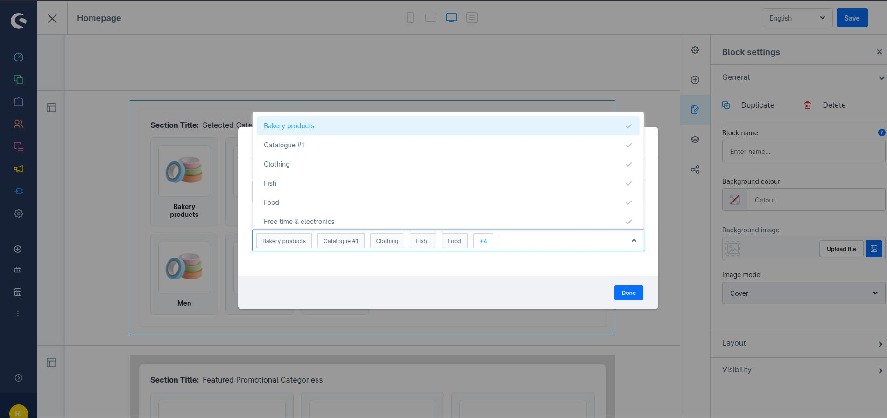
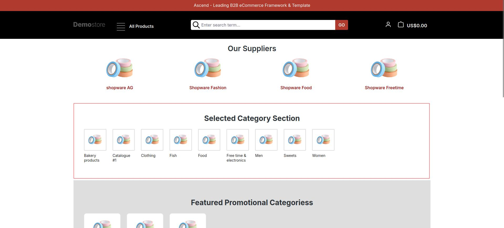
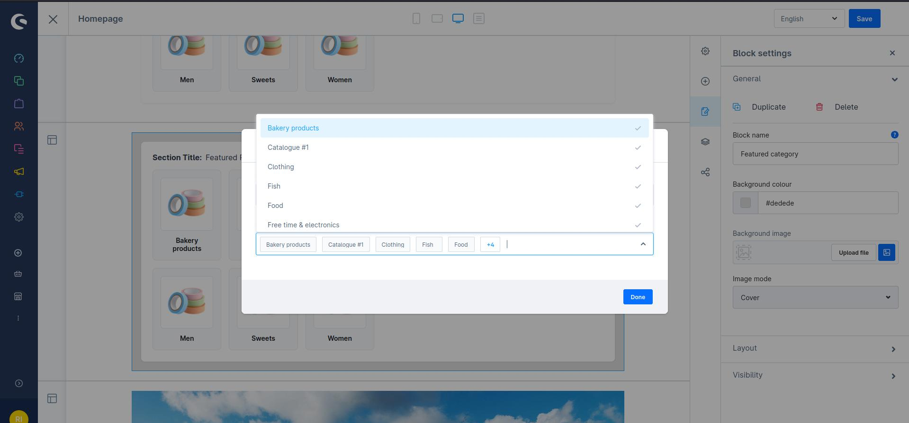
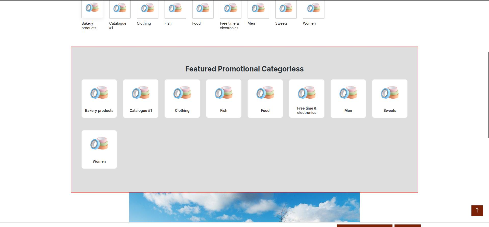

# Featured Category Sections — CMS Elements and Page Extension

*Curated category showcases delivered through two parallel integration paths: CMS elements for layout-builder placement, and a plugin-configured homepage section injected via an event subscriber.*

## Business Problem

Category-led merchandising is the primary navigation path on catalogs with wide, shallow product ranges — the shopper knows the kind of thing they need before they know the product. Merchants wanted curated, image-led category sections on the homepage: a chosen set of categories, each with artwork and a heading, linking straight into the listing.

Shopware's core category navigation renders the tree as it is structured. There was no supported way to promote an arbitrary, hand-picked subset with dedicated presentation. Merchants fell back to hand-built CMS blocks containing hard-coded links and images, which brought the familiar failure mode: links silently break when a category is renamed, moved, or unpublished, images live outside the media manager, and every seasonal change requires someone willing to edit markup in a production CMS block.

There was also a second, subtler requirement. Two different merchant workflows needed the same output:

- Some stores build the homepage in the layout builder and expect the section to be a draggable element like any other.
- Others wanted the section to be a plugin-level setting — configured once per sales channel and rendered independently of layout-editor changes.

Building for only one of those would have left the other workflow unserved.

## Solution

Two curated category sections — a **featured** set and a **selected** set, so a merchant can run two distinct groupings simultaneously — each delivered through **two independent integration paths that share the same rendering**.

**Path one: CMS elements.** Both sections are registered as CMS blocks and elements, placeable through the standard layout builder. Editors pick categories, set a section heading, and position the block anywhere in any layout.

**Path two: plugin configuration.** Both sections are also exposed in the plugin's configuration screen, where an administrator enables the section, sets its heading, and selects categories using Shopware's own entity-picker component. When enabled, the section is injected into the homepage by the plugin.

Both paths converge on the same presentation and the same category payload. Merchants choose the workflow that suits how they operate rather than adapting to how the plugin was built.

**Data integrity comes from the model.** Categories are referenced by identifier and resolved live at render time, with names, images, and URLs read from the current category records. Because categories are resolved from current Shopware records rather than hard-coded markup, renamed or reorganized categories remain much easier to
keep synchronized and the risk of stale storefront links is significantly reduced. This is a key advantage over hard-coded CMS markup and was one reason to implement the feature as a structured extension.

**Links resolve through SEO URLs.** Each tile links via the category's SEO URL, so shoppers and search engines land on the canonical listing address rather than a technical route.

**Presentation degrades cleanly.** Categories without artwork fall back to a default image instead of rendering a broken tile, and a section with no categories selected renders nothing at all rather than an empty heading.

## My Contribution

I designed and implemented both sections and both integration paths:

- Two **CMS element resolvers**, including the context handling that lets them render correctly in the administration's live preview as well as the storefront.
- The **event subscriber** implementing the configuration-driven homepage path, including route guarding and sales-channel-scoped configuration reads.
- The **plugin configuration schema**, using Shopware's entity-picker component for category selection with translated labels and help text.
- The **administration extensions** — CMS blocks, elements, configuration components, and preview components for both sections.
- The **storefront templates**, including the template extension that injects the configured sections into the homepage without overriding the page.
- The **SCSS** and responsive grid behaviour.

## Architecture

**Services.** Three services, all registered in the container with constructor injection and discovered through service tags:

- Two **CMS element resolvers**, one per section, tagged as CMS data resolvers.
- One **event subscriber**, tagged as a kernel event subscriber, receiving the system configuration service, the category repository, the media repository, and a logger.

No custom entities, tables, or controllers are required. Both sections compose existing category data, so the feature does not introduce plugin-owned persistence or schema to maintain.

**Subscribers.** The subscriber listens to the generic page-loaded event and guards on the request's route so it acts only on the homepage — every other page returns immediately, before any configuration read or query. It then reads the plugin's configuration **scoped to the current sales channel**, and for each enabled section resolves the configured categories and attaches the result to the page as a named page extension. Templates read those extensions; the subscriber does no rendering.

Attaching data as page extensions rather than mutating the page object is what keeps the plugin composable — nothing else on the page is affected, and the extension is simply absent when the section is disabled.

**Data resolution.** Both resolvers implement the two-phase CMS contract: a collect phase declaring criteria for the configured category IDs with media and SEO URL associations, keyed per slot; and an enrich phase mapping results into a flat payload of identifier, translated name, translated description, image URL, and SEO URL, attached to the slot as a struct.

The resolvers also handle a real practical problem: **the administration's live preview and the storefront supply different context objects**. Each resolver resolves a framework context defensively — preferring the sales-channel context when rendering the storefront, falling back through the available context accessor, and finally to a default context for preview. Handling both contexts keeps the element usable in the administration preview as well as on the storefront.

**Configuration handling.** Category identifiers may arrive as an array or as a delimited string depending on the input path, so both resolvers normalise to an array — stripping quoting, trimming, and filtering empties — before building criteria. Every configuration read has a default.

**DAL, criteria and repositories.** Category and media repositories are injected as services. Criteria declare the media and SEO URL associations explicitly so images and links resolve in the same query rather than per iteration.

**Administration components.** Two CMS blocks and two CMS elements, each with a canvas component, a configuration component, and a preview component. The plugin configuration screen is declared through configuration schema rather than a custom module, using the platform's multi-entity ID selector bound to the category entity — so administrators get the same searchable category picker they use elsewhere in the admin.

**Storefront templates.** Element templates for both sections, block templates that resolve the content slot, and a template extending the core content-detail page to inject the configuration-driven sections above the normal page content. The extension calls the parent block, so core page content continues to render — the plugin adds to the page rather than replacing it.

## Shopware Concepts Used

- **Symfony services and dependency injection** — constructor injection throughout; services discovered by tag rather than manual bootstrapping.
- **Events and subscribers** — the storefront page-loaded event, with route-level guarding.
- **Page extensions** — data attached to the page object under a namespaced key and consumed from Twig.
- **System configuration** — plugin configuration schema with boolean, text, and entity-selector fields, translated labels and help texts, and defaults; read at runtime scoped to the sales channel.
- **DAL, criteria and associations** — ID-restricted criteria with explicitly declared media and SEO URL associations.
- **CMS elements and blocks** — the full custom-element contract, registered in the administration and resolved server-side.
- **Structs and array entities** — used to carry resolved payloads to templates.
- **Context handling** — sales-channel context versus framework context, including the administration-preview path.
- **SEO URLs** — canonical category links resolved from the SEO URL association.
- **Twig** — element and block templates, template extension with parent block preservation, and namespaced includes.
- **Administration** — Vue-based CMS block, element, configuration, and preview components; the platform's entity multi-select component.
- **Translations** — translated category names and descriptions read through the translation accessor; translated administration snippets.

## Performance

**Guard before you work.** The subscriber checks the route before doing anything else. Non-homepage requests exit immediately, before configuration reads or category-loading work are performed.

**Coordinated CMS data loading.** The element resolvers return criteria from the collect phase rather than querying directly, allowing Shopware's CMS data-resolution layer to coordinate loading with the other CMS elements on the page.

**Associations declared, not lazily traversed.** Media and SEO URL associations are declared on the criteria, so images and links are loaded in the same query as the categories. Resolving them per item inside the render loop would produce an N+1 pattern that scales with the number of tiles.

**Flat render payloads.** Categories are mapped to plain arrays of scalars before reaching Twig, so the template performs no entity traversal or lazy loading while rendering.

**Bounded by configuration.** Sections render only explicitly selected categories, and disabled or empty sections return before category-loading work is performed.

**Section-level short-circuiting.** Each section is independently enabled, so disabled sections do not perform their category-loading work.

## Multi-Channel Support

Multi-channel behaviour was a first-class requirement and is handled at both integration paths.

**Configuration-driven sections** read plugin configuration **scoped to the sales channel of the current request**. Each channel independently controls whether each section is enabled, its heading, and which categories it promotes. A single installation therefore runs different curated merchandising per channel — for example a B2B channel promoting industrial categories while a retail channel promotes consumer ones — from the same catalog and the same plugin, without duplicating the underlying catalog data or maintaining separate code paths per channel.

**CMS-driven sections** inherit channel scoping from Shopware's own layout assignment: layouts are assigned per sales channel, so element configuration is naturally per channel.

Category names and descriptions resolve through the translation layer, and links resolve from SEO URLs in the requesting channel's context, so multi-language and multi-domain channels each receive correctly translated text and correctly formed URLs.

## Accessibility

- Category tiles use a stretched link with an accessible name derived from the category name, so the entire tile is a single, correctly-labelled target rather than several competing links to the same destination.
- Images carry the category name as alt text, with a default-image fallback when category artwork is unavailable.
- Section headings are real headings, so the sections appear in a screen reader's document outline.
- The responsive grid reflows by column count rather than by hiding content, so no category becomes unreachable at small viewport sizes.

## Screenshots

This feature contains two independently configurable category sections. The screenshots below show both the administration selection workflow and their storefront output using demonstration content.

### Selected Category Section — Administration

  

### Selected Category Section — Storefront

  

### Featured Promotional Categories — Administration

  

### Featured Promotional Categories — Storefront

  

---

[← Back to portfolio overview](../README.md)
